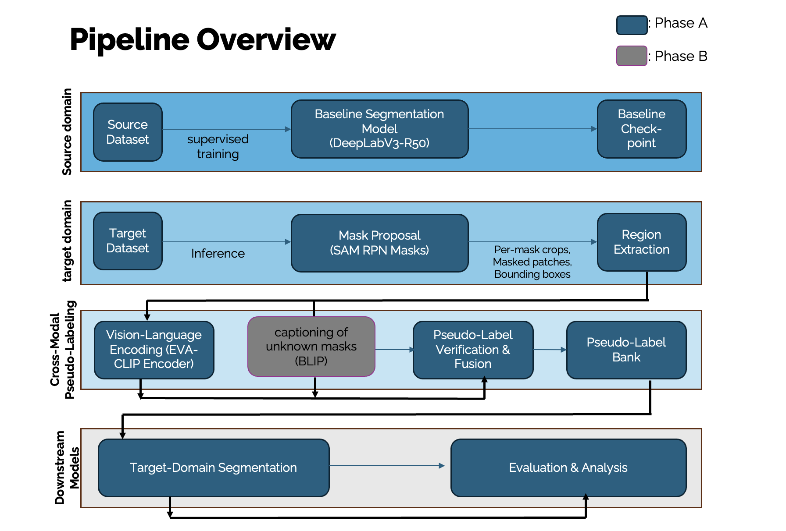

# Cross-Modal Pseudo-Labeling for Domain-Adaptive Semantic Segmentation

Code and experiment scaffolding for a thesis project on **unsupervised domain adaptation (UDA)** for semantic segmentation using **foundation-model-driven pseudo labels** (no target annotations).

## Idea (two-phase pipeline)

**Phase A (core):**
1) **SAM** generates class-agnostic mask proposals on unlabeled target images  
2) **EVA-CLIP** assigns a class label to each proposed region via region–text similarity (fixed class vocabulary + prompts)  
3) **Confidence filtering** removes unreliable regions  
4) Accepted regions are rasterized into **pixel-level pseudo labels**  
5) A segmentation model (e.g., **DeepLabV3-R50**) is **self-trained** on target images using pseudo-label supervision

**Phase B (extension):**
For low-confidence / ambiguous regions, **BLIP** captioning provides an auxiliary language signal to refine or reject labels before training.

## Pipeline diagram

## Benchmarks

- **GTA5 → Cityscapes** (synthetic-to-real urban driving)  
- **iOSB (lab) → Lobbe (factory)** (industrial waste sorting)

## Outputs & diagnostics

In addition to target-domain segmentation metrics (mIoU, PixelAcc), we track pseudo-label diagnostics:
- **Coverage** (fraction of pixels receiving pseudo labels)
- **Correctness on pseudo-labeled pixels** (per-labeled-pixel mIoU / PixelAcc)

## Notes

- Target annotations are used **only for evaluation**.
- Generated artifacts (pseudo-label JSONLs, checkpoints, W&B logs) should typically be ignored via `.gitignore`.

## Repository structure
- sam_clip_full/
- src/ # core pipeline components (SAM proposals, EVA-CLIP labeling, BLIP mapping)
- seg/ # segmentation training (DeepLabv3-R50) + evaluation
- configs/ # experiment configs (paths, thresholds, prompts)
- scripts/ # entrypoints for running pseudo-labeling and training
- docs/ # figures for README (pipeline diagram, qualitative examples)
- notebooks/ # analysis notebooks and blip extension and EVA-CLIP finetuning
- README.md